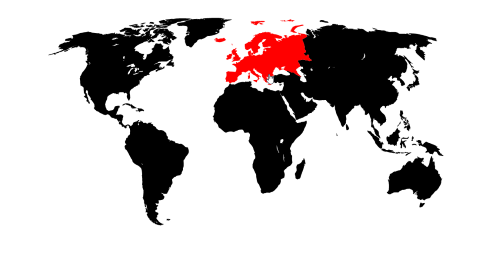
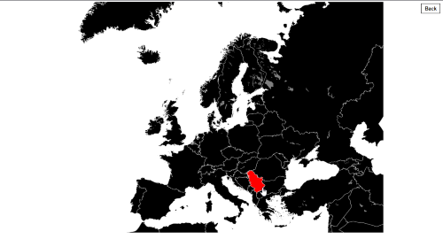
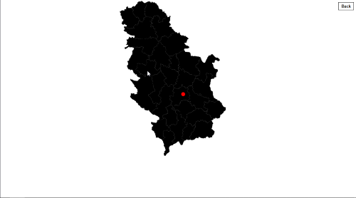
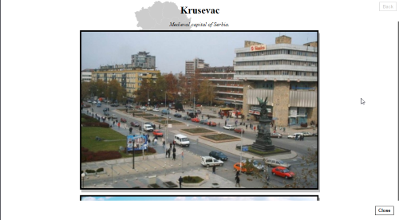

# World Map

*World map code for inserting maps on websites.*


## Add-on Design

### *View*


Example showing how the add-on works.

### *Earth View*


Initial, Earth view with hover option.

### *Continent View*


View when a continent is selected.

### *Country View*


View when a country is selected.

### *Location View*


View when a location is selected.

## Other remarks

### Hosted

- You only need to add the **ned-world-map-ljko.js** file
- Example of how the element should be added in the html is as follows (for Angular):
```
<ned-world-map-ljko [visitedplaces]="visitedplace"></ned-world-map-ljko>
```
- **visitedplace** object should be made according to the example given bellow, and the view would be as in the example above:
```
{
   "Serbia":[
      {
         "title":"Krusevac",
         "circlewidth":10,
         "xpos":325,
         "ypos":477,
         "desc":[
            {
               "type":"text",
               "value":"Medieval capital of Serbia."
            },
            {
               "type":"image",
               "value":"images/image1.jpg"
            },
            {
               "type":"image",
               "value":"images/image2.jpg"
            }
         ]
      }
   ]
}
```
